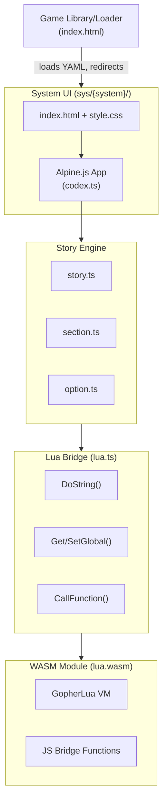

# Codex

An interactive storytelling platform that combines the power of Lua scripting with a modern web interface. Create dynamic, branching narratives with complex game mechanics like combat systems, inventory management, and conditional logic.

## Overview

Codex is a web-based interactive fiction engine inspired by classic gamebooks (like Fighting Fantasy and Choose Your Own Adventure). Stories are defined in YAML format with embedded Lua code for game logic, and rendered in a clean, responsive web interface.

**Key Features:**

- **Lua-Powered Logic**: Complex game mechanics using embedded Lua scripts
- **YAML Story Format**: Simple, human-readable story definitions
- **Systems Architecture**: Themed UI systems (e.g., Fighting Fantasy, Sci-Fi) with custom styling and character sheets
- **Decoupled Stories**: Stories are independent YAML files that run on any compatible system
- **WebAssembly Integration**: Go-based Lua VM compiled to WASM for browser execution
- **Reactive UI**: Built with Alpine.js for a smooth, interactive experience
- **Persistent State**: Automatic save/load of game progress via localStorage
- **Character Sheet**: System-specific stats, inventory, and item tracking
- **Conditional Options**: Dynamic choice visibility based on game state
- **Combat System**: Built-in support for dice-rolling and turn-based combat
- **Event System**: Trigger custom handlers for items and actions

## Architecture and Design

### Technology Stack

**Backend (Lua VM):**

- **Go 1.25+**: WASM module compilation
- **GopherLua**: Lua 5.1 implementation in Go
- **WebAssembly**: Lua VM runs entirely in-browser via WASM

**Frontend:**

- **TypeScript**: Type-safe application code
- **Alpine.js 3**: Lightweight reactive framework
- **Vite**: Modern build tooling and dev server
- **YAML**: Story file format

### Architecture Overview



### Systems

Systems are themed frontends that provide the UI layer for running stories. Each system defines:

- **Custom HTML template**: Layout and structure for the story interface
- **Custom CSS styling**: Fonts, colors, and visual theme
- **Character sheet fields**: System-specific stats and inventory display

Stories specify which system they run on via the `system` field in the YAML header. This decouples story content from presentation, allowing:

- Multiple stories to share the same system/theme
- Custom stories to be created without modifying the frontend
- Different UI experiences for different genres (fantasy, sci-fi, etc.)

**Built-in Systems:**

| System             | Description                                        | Character Sheet                                          |
| ------------------ | -------------------------------------------------- | -------------------------------------------------------- |
| `fighting-fantasy` | Classic gamebook style with medieval fantasy theme | Stamina, Skill, Luck, Gold, Equipment, Consumables       |
| `sci-fi`           | Futuristic space theme                             | Stamina, Skill, Luck, Oxygen, Keycards, Equipment, Items |

Systems are located in [web/sys/](web/sys/), with each system having its own `index.html` and `style.css`.

### Core Components

#### 1. **Story Engine** ([web/src/codex/](web/src/codex/))

- **[story.ts](web/src/codex/story.ts)**: Main story class, parses YAML, manages sections and global state
- **[section.ts](web/src/codex/section.ts)**: Individual story sections with text, options, and local variables
- **[option.ts](web/src/codex/option.ts)**: User choices with conditions, actions, and navigation
- **[story-types.ts](web/src/codex/story-types.ts)**: TypeScript type definitions for YAML structure

#### 2. **Lua Bridge** ([web/src/lua/](web/src/lua/))

- **[lua.ts](web/src/lua/lua.ts)**: TypeScript interface to WASM Lua VM
- **[wasm-exec.mjs](web/src/lua/wasm-exec.mjs)**: Go's WASM runtime support

#### 3. **Go WASM Module** ([golua/main.go](golua/main.go))

- Embeds GopherLua interpreter
- Exposes bridge functions via global `lua` object
- Handles type conversion between Lua and JavaScript

#### 4. **Web Application** ([web/src/codex.ts](web/src/codex.ts))

- Alpine.js reactive state management
- Section navigation and option handling
- System-specific character sheet display
- Save/load system via localStorage
- Notification and confirmation dialogs

### Key Design Patterns

**For detailed story creation instructions, see [STORY_GUIDE.md](STORY_GUIDE.md).**

1. **Lua State Management**:

   - Global variables persist across sections
   - Section-specific variables (`s.*`) scoped to each section
   - Temporary variables (`temp.*`) reset on each section visit

2. **Variable Interpolation**: Use `{expression}` in story text to embed Lua expressions

3. **Conditional Options**: Options can have `if` conditions evaluated in Lua

4. **Option Flags**: Control option behavior (`once`, `first`, `not_first`)

5. **YAML Templates**: Reusable option sets using YAML anchors for common patterns like combat

## Running Locally

### Prerequisites

- **Go 1.25+** (for building the WASM module)
- **Node.js 18+** and npm (for the web frontend)
- **Make** (optional, for build automation)

### Quick Start

1. **Clone the repository**:

   ```bash
   git clone https://github.com/benc-uk/codex.git
   cd codex
   ```

2. **Install dependencies**:

   ```bash
   make install
   # Or manually:
   cd web && npm install
   go mod download
   ```

3. **Build the Lua WASM module**:

   ```bash
   make build-lua
   # Or manually:
   GOOS=js GOARCH=wasm go build -o web/public/lua.wasm golua/main.go
   ```

4. **Start the development server**:

   ```bash
   make run
   # Or manually:
   cd web && npm run dev
   ```

5. **Open in browser**:
   - Navigate to `http://localhost:5173`
   - The default story (`main.yaml`) will load automatically

### Available Make Targets

```bash
make install      # Install all dependencies
make build-lua    # Build the Lua WASM module
make run          # Start Vite dev server
make clean        # Remove built files and node_modules
make lint         # Run linters and format checks
```

### Loading Stories

The root URL (`http://localhost:5173/`) displays a **Game Library** - a visual bookshelf interface showing available stories organized by genre. Click a book to play that story.

**How story loading works:**

1. When a story is selected, the loader fetches and parses the YAML to determine its `system`
2. The browser redirects to `/sys/{system}/?story={story-url}`
3. The system's themed UI loads and runs the story

**Built-in stories** are in [web/public/story/](web/public/story/) and appear in the library automatically.

**Custom stories** can be loaded from any accessible URL:

- Navigate to `http://localhost:5173/?storyUrl={url-to-yaml-file}`
- The story YAML must specify a valid `system` in its header
- Example: `http://localhost:5173/?storyUrl=https://example.com/my-story.yaml`

This allows story authors to host their own content separately from the Codex engine, while still using the themed UI systems.

## Developer Guide

This section is for developers who want to contribute to or modify the Codex engine itself (TypeScript/Go codebase).

### Development Environment Setup

1. **Install required tools**:

   ```bash
   # Go 1.25+ for WASM compilation
   go version

   # Node.js 18+ and npm
   node --version
   npm --version
   ```

2. **Clone and setup**:

   ```bash
   git clone https://github.com/benc-uk/codex.git
   cd codex
   make install
   ```

3. **Development workflow**:

   ```bash
   # Terminal 1: Build WASM when Go code changes
   make build-lua

   # Terminal 2: Run dev server with hot reload
   make run
   ```

### Code Organization

**TypeScript (Frontend)**:

- [web/src/codex.ts](web/src/codex.ts): Main entry point, Alpine.js app state and UI logic
- [web/src/codex/story.ts](web/src/codex/story.ts): Core story engine, YAML parsing, Lua integration
- [web/src/codex/section.ts](web/src/codex/section.ts): Section lifecycle and state management
- [web/src/codex/option.ts](web/src/codex/option.ts): Option conditions, execution, and navigation
- [web/src/lua/lua.ts](web/src/lua/lua.ts): TypeScript interface to WASM Lua VM
- [web/sys/](web/sys/): System UI templates and stylesheets

**Go (WASM Bridge)**:

- [golua/main.go](golua/main.go): Lua VM initialization and JS bridge functions

### Working with TypeScript

#### Key Interfaces

```typescript
// Story parsing and management
class Story {
  static async parse(url: string): Promise<Story>
  getSection(id: string): Section | undefined
  getGlobals(): Record<string, BasicType>
  setGlobal(name: string, value: BasicType): void
  trigger(eventId: string, ...args: BasicType[]): string
  static replaceVars(text: string): string
}

// Section management
class Section {
  get text(): string // Text with interpolated variables
  get options(): Map<string, Option> // Available options
  visit(): void // Mark visited and run code
}

// Option handling
class Option {
  isAvailable(section: Section): boolean
  execute(): Result
}
```

#### Adding New Story Features

1. **Update YAML types** in [story-types.ts](web/src/codex/story-types.ts):

   ```typescript
   export interface StoryYAML {
     title: string
     // ... add new fields
   }
   ```

2. **Implement parsing** in [story.ts](web/src/codex/story.ts):

   ```typescript
   static async parse(url: string): Promise<Story> {
     // ... parse new fields from YAML
   }
   ```

3. **Add UI support** in [webapp.ts](web/src/webapp.ts) or [index.html](web/index.html)

#### TypeScript Build and Lint

```bash
cd web

# Type checking
npm run build

# Linting
npm run lint

# Format code
npm run format
```

### Working with Go/WASM

#### Modifying the Lua Bridge

The Go code exposes Lua functionality to JavaScript via a global bridge. Key functions in [golua/main.go](golua/main.go):

- `doString`: Execute Lua code strings
- `getGlobal` / `setGlobal`: Access Lua variables
- `getAllGlobals`: Retrieve all globals as JS object
- `callFunction`: Invoke Lua functions by name

#### Adding New Bridge Functions

1. **Define the function** in [main.go](golua/main.go):

   ```go
   func myNewFunction(this js.Value, args []js.Value) interface{} {
       // Your implementation
       return result
   }
   ```

2. **Register it** in `main()`:

   ```go
   luaBridge.Set("MyNewFunction", js.FuncOf(myNewFunction))
   ```

3. **Update TypeScript interface** in [lua.ts](web/src/lua/lua.ts):

   ```typescript
   export interface LuaVM {
     // ... existing methods
     MyNewFunction(arg: string): BasicType
   }
   ```

4. **Rebuild WASM**:
   ```bash
   make build-lua
   ```

#### Go Build Process

The WASM module is built with specific flags:

```bash
GOOS=js GOARCH=wasm go build -o web/public/lua.wasm golua/main.go
```

This creates a ~2-3MB WASM file that includes the full GopherLua interpreter.

#### Type Conversion

The bridge handles type conversion between JS and Lua:

- `luaToJsVal()`: Converts Lua values (LValue) to js.Value
- `jsValToLua()`: Converts js.Value to Lua LValue
- Supports: bool, number, string, nil, tables (objects/arrays)

### Testing and Debugging

#### Frontend Debugging

1. **Browser DevTools Console**:

   ```javascript
   // Access Lua VM directly
   lua.DoString('return stamina')
   lua.GetAllGlobals()

   // Inspect Alpine state
   Alpine.store('appState')
   ```

2. **Vue DevTools**: Alpine.js state can be inspected (Alpine devtools extension)

3. **Network Tab**: Monitor story YAML file loading

#### WASM Debugging

1. **Console Logs**: Go `fmt.Println()` appears in browser console
2. **Error Handling**: Lua errors are caught and returned as JS Error objects
3. **Performance**: Use browser profiler to identify bottlenecks

#### Common Issues

- **WASM not loading**: Check `web/public/lua.wasm` exists, rebuild with `make build-lua`
- **Lua errors**: Check console for detailed error messages with line numbers
- **Type mismatches**: Verify type conversions in bridge functions
- **State issues**: Remember Lua state persists across sections

### Code Style and Standards

#### TypeScript

- Use strict typing (no `any`)
- Document public methods with JSDoc comments
- Follow existing naming conventions (camelCase)
- Use ES6+ features (async/await, arrow functions)
- Run prettier before committing: `npm run format`

#### Go

- Follow standard Go formatting (gofmt)
- Comment exported functions
- Handle errors explicitly
- Run linter: `make lint`

### Building for Production

```bash
# Build WASM module
make build-lua

# Build optimized frontend
cd web
npm run build

# Output is in web/dist/
```

Deploy the `web/dist/` directory to any static hosting service (Netlify, Vercel, GitHub Pages, etc.).

### Contributing

1. Fork the repository
2. Create a feature branch: `git checkout -b feature/my-feature`
3. Make your changes and test thoroughly
4. Run linters: `make lint`
5. Commit with clear messages
6. Push and create a pull request

### Extending the Engine

Common extension points:

1. **New Lua helper functions**: Add to init code in [story.ts](web/src/codex/story.ts) `parse()` method
2. **Custom UI components**: Extend Alpine.js state in [webapp.ts](web/src/webapp.ts)
3. **Additional YAML features**: Modify parsing in [Story.parse()](web/src/codex/story.ts)
4. **New option flags**: Add handling in [option.ts](web/src/codex/option.ts) `isAvailable()` or `execute()`

## Story Creation Guide

For story authors who want to create content using Codex, see the comprehensive [**Story Development Guide (STORY_GUIDE.md)**](STORY_GUIDE.md).

The guide covers:

- Complete YAML story format reference
- Variables, sections, and options
- Lua scripting and built-in functions
- Events and hooks system
- Templates for reusable content
- Best practices and complete examples

### Quick Start for Story Authors

1. Create a YAML file with the required header including `title` and `system`
2. Choose a system that matches your story's genre (e.g., `fighting-fantasy`, `sci-fi`)
3. Define variables, events, and sections
4. Host your story file anywhere accessible via URL
5. Load it via `http://localhost:5173/?story=your-story-url`

Example story header:

```yaml
title: My Adventure
system: fighting-fantasy
author: Your Name
version: 1.0
```

See [STORY_GUIDE.md](STORY_GUIDE.md) for the full guide.

### Project Structure

```
codex/
├── golua/
│   └── main.go              # Go/WASM Lua bridge
├── web/
│   ├── public/
│   │   ├── story/           # Built-in story YAML files
│   │   │   ├── cave.yaml
│   │   │   ├── station-omega.yaml
│   │   │   └── warlock.yaml
│   │   └── lua.wasm         # Built WASM module (generated)
│   ├── src/
│   │   ├── codex/           # Story engine
│   │   │   ├── story.ts     # Main story class
│   │   │   ├── section.ts   # Section management
│   │   │   ├── option.ts    # Option handling
│   │   │   └── story-types.ts
│   │   ├── lua/             # WASM bridge
│   │   │   ├── lua.ts
│   │   │   └── wasm-exec.mjs
│   │   ├── utils/           # Utilities
│   │   │   └── strings.ts
│   │   └── codex.ts         # Main engine entry point
│   ├── sys/                 # UI Systems (themes)
│   │   ├── fighting-fantasy/
│   │   │   ├── index.html   # Fantasy-themed UI template
│   │   │   └── style.css    # Medieval styling & fonts
│   │   └── sci-fi/
│   │       ├── index.html   # Sci-fi themed UI template
│   │       └── style.css    # Futuristic styling & fonts
│   ├── package.json
│   └── tsconfig.json
├── go.mod
├── go.sum
├── makefile
└── README.md
```

## Other Notes

### Browser Compatibility

- **Modern browsers only**: Requires WebAssembly support
- Tested on: Chrome 90+, Firefox 88+, Safari 15+, Edge 90+

### Performance Considerations

- WASM module loads once and is cached
- Lua state persists for the session
- localStorage saves are JSON-serialized (size limits apply)

### Limitations

- Lua VM is single-threaded
- No asynchronous Lua operations
- WASM module size: ~2-3MB (includes full Lua interpreter)
- Go's WASM exports are limited, hence the global bridge approach

### Why Go + WASM for Lua?

This project uses an unconventional stack (Go → WASM → Lua → JS) because:

1. **No native browser Lua**: Lua doesn't compile to WASM directly
2. **GopherLua is mature**: Excellent Lua 5.1 implementation in Go
3. **Go's WASM support**: First-class WASM compilation
4. **Security**: Sandboxed execution in browser

Alternative approaches considered:

- **Fengari** (Lua in JS): Performance and compatibility issues
- **Native JS logic**: Loses Lua's flexibility and expressiveness
- **Server-side Lua**: Requires backend infrastructure

### Future Enhancements

Potential improvements:

- Visual story editor
- Save file export/import
- Additional built-in systems/themes
- System creation documentation
- Multiplayer/shared game states
- Audio/music support
- Enhanced combat system with graphics
- Story analytics and playtesting tools
- TypeScript type generation from story YAML

### License

Copyright (C) 2025 Ben Coleman  
Licensed under the MIT License

### Contact

- GitHub: [@benc-uk](https://github.com/benc-uk)
- Repository: [github.com/benc-uk/codex](https://github.com/benc-uk/codex)
